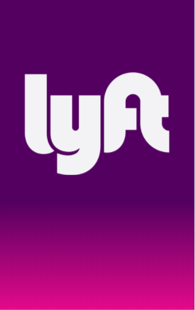
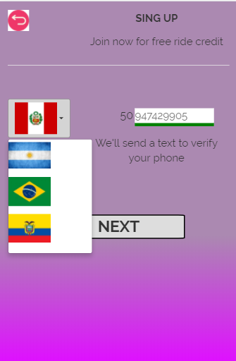
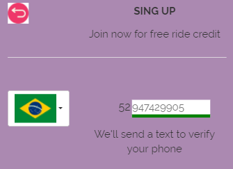
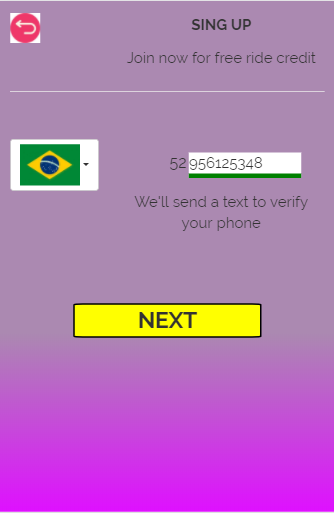
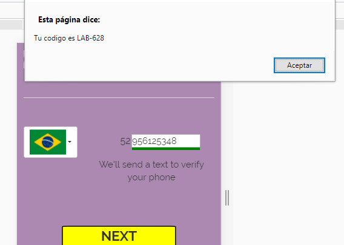
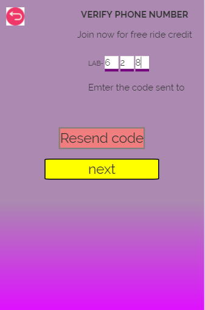
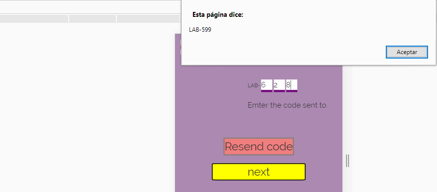
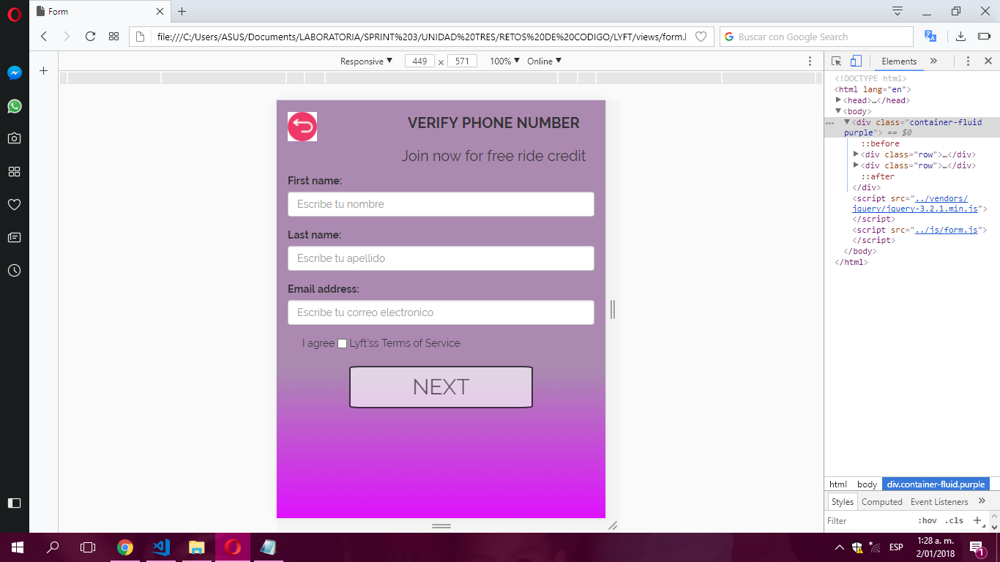
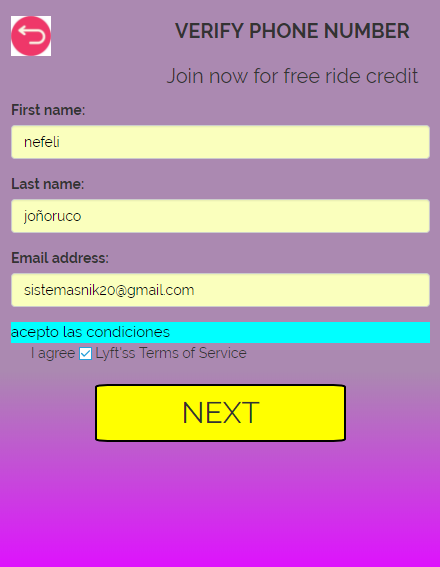
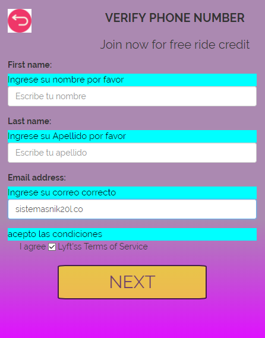

*LYFT

NEFELI JOÑORUCO MORALES

**Objetivos

***Desarrolla una web-app que replique el sitio de Lyft, en este reto deberás cumplir los pasos necesarios para que tu usuario pueda registrarse

****FUNCIONALIDAD PARA LAS VISTAS

1.Se muestra la vista de de carga por cinco segundo.
;
2.Se muestra la pantalla principal con dos opciones. Elegimos SING UP
;
3.En esta vista se nos da la opcion de elegir una de las banderas.
;
4.Al elejir la bandera del pais deseado el codigo postal cambia.
;
5.Al ingresar 9 digitos el input se activara. Poniendose de color amarillo
;
6.Se generara un alert automaticamente que se validara en la siguiente vista.
;
7.Ingresamos el codigo del alert anterior y automaticamente se habilita el boton next.
;
8.Si olvidamos algun digito del codigo anterior, tenemos la opcion de Resend code, este nos generara nuevo codigo
;
9.Una ves verificado el codigo podremos rellenar el siguiente formulario.
;
10.Si se rellena los datos de maner correcta el boton Next se habilita automaticamente.
;
11.Si dejamos campos vacios en los dos primeros inputs o si no logramos cumplir con las condiciones del email nos aparecera un mensaje de color aqua indicando que debemos hacer.
;

